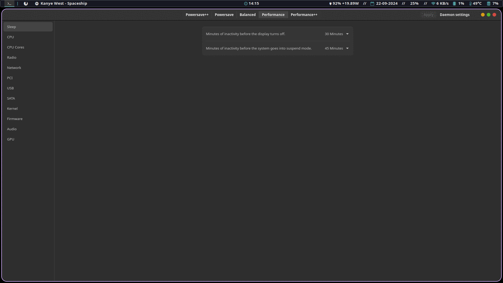
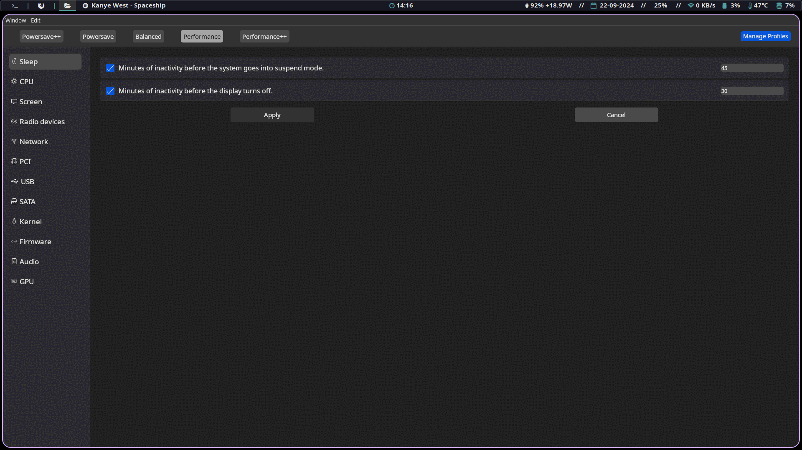

<div align="center">
    
    <h1>
        Power Options
    </h1>
    <a href="https://discord.gg/KyZt97MvdU">
        
    </a>
    <a href="https://www.paypal.com/paypalme/AlexanderKarpukhin2">
        
    </a>
</div>

<br/>

*Warning: power options **will** enable usb autosuspend on first-run if you are on
battery power, potentially disabling some input devices during inactivity. Go
into the frontend of your choice and include in the blacklist devices that you
do not want to follow usb autsuspend.*

All-In-One blazingly fast Linux GUI Application for simple and advanced power
management on any device.

Power Options can be a drop in replacement for any power-saving application,
including TLP, auto-cpufreq, cpupower-gui, etc. Power Options covers all of the
most common power saving settings and adds additional ones not present in any other application.

Upon install, Power Options will analyze the system and intelligently generate a wide range
of profiles based on the findings. These profile are greatly optimized and shouldn't
require intervention, unless the user wants more control.

Most applications only allow two profiles: Battery Profile and AC profile. This
is suboptimal for ocasions where one might want greater control. This is what
led to the creation of the profile system that this program uses:
- The user can have as many profiles as they please
- The user chooses which profiles will be selected for Battery and AC.
- The user can temporarily override the profile selection to another one until
  they remove that override.
- The user may set a persistent override that will be kept across reboots.

## Available Frontends/Interfaces

One can simply install the daemon and edit the configuration files manually
as those are written in TOML. But the biggest strength of this program
are the GUI interfaces it provides, as almost any other power saving tool does not
have one and resorts to configuration files.

### Native GTK frontend

Simple, lightweight and native with a simple interface. Recommended for most
users.



### WebKit frontend

More advanced options and greater control. Not as lightweight. Recommended for
advanced users and users who are looking to use power-options in tandem with
another power management solution.



## Features

Power options was made based on a recollection of all the tips and
recommendations from the biggest linux wikis and guides as well as other power
saving applications. Some examples include:
- https://wiki.archlinux.org/title/Power_management
- https://wiki.gentoo.org/wiki/Power_management/Guide
- https://en.wikipedia.org/wiki/Power_management
- https://github.com/supplantr/ftw
- https://github.com/linrunner/TLP
- https://github.com/AdnanHodzic/auto-cpufreq
- https://github.com/vagnum08/cpupower-gui

Power Option includes the following features:
- More profile types than alternatives
- Can smartly generate profiles by analyzing the user's system.
- System Sleep Options (suspend, screen turn off)
- CPU Options
- Individual CPU Core Options. Most power saving tools lack this option and was
  one of the main motivations for this project.
- Screen Options
- Options for disabling radio components (e.g Bluetooth, WiFi, NFC)
- Network Options. Allows WAY greater control than alternative applications, but
  does require network driver reload. Limited to Intel network cards that use
  iwlwifi.
- ASPM Options
- PCI Options
- USB Options
- SATA Options
- Kernel Options
- Firmware settings
- Audio Options
- GPU Options

## Installation


### Arch Linux

There are 6 AUR packages for power-options.

- GTK: `power-options-gtk` (stable) and `power-options-gtk-git` (bleeding edge)
- Webview: `power-options-webview` (stable) and `power-options-webview-git` (bleeding edge)
- Just the daemon: `power-options-daemon` (stable) and `power-options-daemon-git` (bleeding edge)


### Fedora

The COPR GTK package is maintained by [@lpuv](https://github.com/lpuv)

```bash
sudo dnf copr enable leo/power-options 
sudo dnf install power-options
```

### Other distros / from source

- GTK: 

To build, requires dev libraries `libgtk4-dev` `libadwaita-1-dev` (or the equivalent in
your distro)
```bash
git clone https://github.com/TheAlexDev23/power-options/ --depth=1
cd power-options/scripts
chmod +x *.sh
# Run as local user, will require sudo password
./install-gtk.sh
# If installing for the first time
./setup.sh
# If updating
./update.sh
```

- Webview: 

To build, requires dev libraries `libsoup-3.0-dev`, `libwebkit2gtk-4.1-dev` and
`libxdo-dev` (or the equivalent in your distro)
```bash
# dioxus-cli is required
cargo install dioxus-cli
git clone https://github.com/TheAlexDev23/power-options/ --depth=1
cd power-options/scripts
chmod +x *.sh
# Run as local user, will require sudo password
./install-webview.sh
# If installing for the first time
./setup.sh
# If updating
./update.sh
```

- Just the daemon:

```bash
git clone https://github.com/TheAlexDev23/power-options/ --depth=1
cd power-options/scripts
chmod +x *.sh
# Run as local user, will require sudo password
./install-daemon.sh
# If installing for the first time
./setup.sh
# If updating
./update.sh
```

## Dependencies

For *build* dependendencies, refer to the installation guide above.

Mandatory:
- zsh
- lspci
- lsusb
- acpi

Optional:
- iwlwifi compatible network card for network configuration
- Intel sound card for audio configuration
- Intel/AMD GPU for GPU configuration
- xrandr: resolution/refresh rate control
- brightnessctl: brightness control
- ifconfig: ethernet blocking
- xset: screen turn off timeout
- xautolock: system suspend timeout

Webview frontend:
- webkit2gtk
- dioxus-cli

GTK frontend:
- yad
- libadwaita

## Updating 

If you've installed using the AUR, your package manager should handle the
updates.

If you've installed using install scripts, simply pull the latest changes and
re-run the install scripts again and `./update.sh`. **Important, do not run
`./uninstall.sh`, `./setup.sh` or `power-daemon-mgr setup` if you
want to keep your profiles**

## Limitations
- Network configuration only works on Intel cards and cards that use iwlwifi
- Resolution and refresh rate control only works on X11 (other options should
  work though).
- Audio configuration only works on Intel cards and cards that use `snd_hda_intel`
  or `snd_ac97_codec`
- GPU configuration only works on Intel and AMD cards or cards that use `i915`,
  `amdgpu` or `radeon` drivers/modules.
- Settings for resolution and refresh rate control are only available on the
  webview frontend.

## Contributing

One of the easiest ways to help, is by opening issues when you encounter errors.
This lets the developers know what to fix, and allows future users with the same
issue find a fix for their problem.

Linux is a large ecosystem, there are alternatives for almost everything. And
while power-options was built to be used with the most popular Linux software,
you can still help by porting power-options to other alternatives that you use
by opening PRS. Examples could include, porting power-options away from systemd, 
adding some X exclusive features to wayland, etc. 

The `dev` branch will almost always have some experimental features that still
remain to be merged into the `main` branch. If your hardware supports those
features, the developers will be really greatful if you could test them in your
system and inform of potential issues. Using the power-options Discord server is 
recommended for those use cases.

## Acknowledgements
- Arch Linux Wiki (https://wiki.archlinux.org)
- TLP (https://github.com/linrunner/TLP)
- Open Source Figma Icon set (https://www.figma.com/community/file/1250041133606945841/8-000-free-icons-open-source-icon-set)
